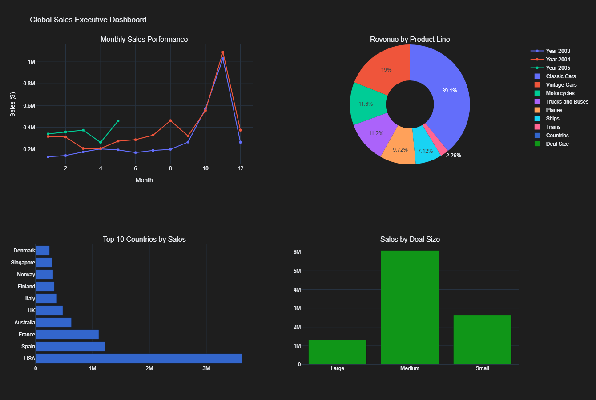

# 🏎️ Automotive Sales Analytics & Customer Segmentation Portfolio

## 📊 Project Overview
This project provides a comprehensive data-driven analysis of a global sales dataset (Classic Cars, Planes, Ships). It demonstrates a full data pipeline—from **cleaning and normalization** to **advanced SQL querying** and **predictive business insights**.

> **Dataset:** [Sample Sales Data (Kaggle)](https://www.kaggle.com/datasets/kyanyoga/sample-sales-data) — 2,823 transactions covering the period 2003-2005.

---

## 🖼️ Executive Dashboard Preview
 
*If the interactive charts do not load, you can view the static preview above.*

👉 **[View the Interactive Python Notebook (Direct Render)](https://nbviewer.org/github/Omneya21/sales-data-analysis-portfolio/blob/main/Sales_Dashboard.ipynb)**
---

## 🛠️ Tech Stack & Skills
| Tool | Application |
| :--- | :--- |
| **Python** | Data cleaning (Pandas), Visualization (Plotly, Matplotlib, Seaborn) |
| **SQL (SQLite)** | Relational database modeling, CTEs, Window Functions, Complex Joins |
| **Analytics** | RFM Segmentation, Cohort Analysis, Sales Forecasting |

---

## 🚀 Key Achievements & Business Insights

### 1. Data Architecture
* **Relational Modeling:** Normalized raw data into a structured SQLite database (`Products`, `Customers`, `Orders`).
* **Data Integrity:** Cleaned missing values and standardized categorical fields for accurate reporting.

### 2. Strategic Analysis (Answering Business Questions)
* **Market Dominance:** Identified **Classic Cars** as the primary revenue driver, particularly in the **USA, Spain, and France**.
* **Seasonality:** Detected significant sales peaks in **Q4** annually, driven by year-end promotions.
* **Top Performers:** Isolated "Euro Shopping Channel" as the lead customer ($912K+ Revenue).
* **Customer Behavior:** Performed **RFM (Recency, Frequency, Monetary)** segmentation to categorize loyal vs. at-risk customers.
* **Retention:** Created a **Cohort Analysis Heatmap** to track customer lifecycles and repeat purchase rates.

---

## 📁 Repository Structure
* 📝 `Sales_Dashboard.ipynb` → Full Python code, data cleaning, and visualizations.
* 📊 `sales_data_cleaned.csv` → The processed and cleaned dataset used for analysis.
* 🗄️ `sales_database.db` → Normalized relational database file.
* 🖼️ `monthly_sales_trend.png` → Sales performance over time.
* 🖼️ `cohort_analysis_heatmap.png` → Customer retention visualization.
* 🖼️ `dashboard.png` → Screenshot of the final interactive dashboard.

---

## ⚙️ How to Run
1. Clone this repository to your local machine.
2. Open `Sales_Dashboard.ipynb` in **Google Colab** or **Jupyter Notebook**.
3. Ensure the `sales_data_cleaned.csv` file is in the same directory.
4. Run all cells sequentially to generate the interactive visualizations.

---
**Contact & Portfolio**
* **Project by:** Omneya
* **GitHub Profile:** [Omneya21](https://github.com/Omneya21)
* **Role:** Data Analyst Enthusiast
